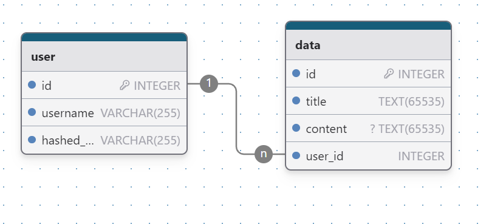

# Private Notes Web App

The aim of this app is to be a online place where people will be able to write their thoughts, it's not intended to be a real applications, it's just for learning. The application has a basic frontend, builded with Html and Css; a database, it uses MySQL and SQLMODel(Python ORM library similar to SQLAlchemy) and the backend is built with Python and FastApi

- Here's the database schema:

It is a very simple database, just for save the user's account and their writtings. Both password and content are ecrypted.
